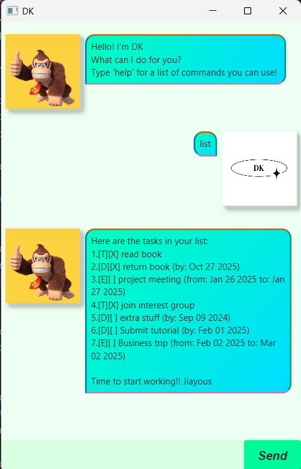

# DK User Guide



DK Chatbot is a task management tool, aimed to help users create and track various types of tasks.
With a command-line interface in mind, DK Chatbot offers both efficient input via commands, 
and engaging output via the GUI.


- [Quick Start](#quickstart)

- [Features](#features)
  - [Help: `help`](#help)
  - [View all tasks: `list`](#list-tasks)
  - [Add a new Todo task: `todo`](#todo)
  - [Add a new Deadline task: `deadline`](#deadline)
  - [Add a new Event task: `event`](#event)
  - [Marking a task as COMPLETE: `mark`](#mark)
  - [Marking a task as NOT COMPLETE: `unmark`](#unmark)
  - [Delete an existing task: `delete`](#delete)
  - [Finding tasks by description: `find`](#find)
  - [Exiting the program: `bye`](#bye)
  - [Saving / Loading of Data](#data)

## <a name="quick-start">Quick Start</a>

1. Ensure that Java `17` or above is installed on your computer.
   - For **MAC Users:** Ensure that the precise JDK version is correctly installed based on 
   [this link](https://se-education.org/guides/tutorials/javaInstallationMac.html)
2. Download the latest `.jar` file from [here](https://github.com/garennotjeron/ip/releases)

3. Copy the file to your preferred folder for your own DK Chatbot!

4. Open a command terminal and enter the directory where the .jar file is located at

5. Run the application
   - Use `java -jar dk.jar`

6. Type a command in the input box and press Enter to execute the command.

   Some example commands include:
   - `list` - List all current tasks in the list
   - `todo return book` - Creates a Todo task with "return book" as the description
   - `mark 2` - Marks the 2nd task in the task list as COMPLETE
   - `find book` - Shows all tasks that have the keyword "book" in its description

You can refer to the [Features](#features) section below for details on each command.

## <a name="features">Features</a>
### <a name="help">Help: `help`</a>
Shows a message displaying the list of existing commands

Format: `help`

Output:
```
help
________________________
Here is a list of commands for you:

1. help - Prints a list of available commands
2. list - Displays all tasks
3. todo {description} - Creates a Todo Task
4. deadline {description} /by {deadline} - Creates a Deadline Task
5. event {description} /from {startDate} /to {endDate} - Creates an Event task
6. mark {number} - Marks specified task as completed
7. unmark {number} - Marks specified task as not completed
8. delete {number} - Deletes specified task based on index
9. find {keyword} - Finds all tasks that include the keyword
10. bye - Closes the application
```

### <a name="list-tasks"> View all tasks: `list`</a>
Displays a list of all tasks in the task list

Format: `list`

Output:
```
list 
________________________
Here are the tasks in your list:
1.[T][X] Read book
2.[D][X] Return book (by: Oct 27 2025)
3.[E][] Project Meeting (from: Jan 26 2025 to: Jan 27 2025)

Time to start working!! Jiayous
```

### <a name="todo"> Add a new Todo task: `todo`</a>
Creates a Todo task and adds it to the task list

Format: `todo {description}`

Output:
```
todo Do tutorial
________________________
Got it. I've added this task:
[T][] Do tutorial
Now you have 4 tasks in the list.

Stay strong :D
```

### <a name="deadline"> Add a new Deadline task: `deadline`</a>
Creates a Deadline task and adds it to the task list

Format: `deadline {description} /by {dueDate}`
- `dueDate` should be in the following format: "yyyy-MM-dd"

Output:
```
deadline Submit tutorial /by 2025-02-01
________________________
Got it. I've added this task:
[D][] Submit tutorial (by: Feb 01 2025)
Now you have 5 tasks in the list.

Stay strong :D
```

### <a name="event"> Add a new Event task: `event`</a>
Creates an Event task and adds it to the task list

Format: `event {description} /from {startDate} /to {endDate}`
- `startDate` and `endDate` should be in the following format: "yyyy-MM-dd"

Output:
```
event Business trip /from 2025-02-02 /to 2025-03-02
________________________
Got it. I've added this task:
[E][] Business trip (from: Feb 02 2025 to: Mar 02 2025)
Now you have 6 tasks in the list.

Stay strong :D
```

### <a name="mark"> Marking a task as COMPLETE: `mark`</a>
Marks an existing task in the tasklist as complete

Format: `mark {index}`
- `index` refers to the number tagged to the task in the task list
- `index` should be a **positive integer** (1, 2, 3, ...)

Output:
```
mark 4
________________________
YAY, you did it! I'll mark this task as done for you:

4. [T][X] Do tutorial
```

### <a name="unmark"> Marking a task as NOT COMPLETE: `unmark`</a>
Marks an existing task in the tasklist as not complete

Format: `unmark {index}`
- `index` refers to the number tagged to the task in the task list
- `index` should be a **positive integer** (1, 2, 3, ...)

Output:
```
unmark 4
________________________
Noooo :(
I'll go mark this task as not done yet...

4. [T][] Do tutorial
```

### <a name="delete"> Delete an existing task: `delete`</a>
Deletes the specified task from the task list

Format: `delete {index}`
- `index` refers to the number tagged to the task in the task list
- `index` should be a **positive integer** (1, 2, 3, ...) 

Output:
```
delete 4 
________________________
Oh? I've removed this task:
[T][] Do tutorial

Better not be cheating the system...
Now you have 3 tasks in the list!!
```

### <a name="find"> Finding tasks by description: `find`</a>
Finds all tasks whose description includes the given keyword

Format: `find {keyword}`
- `keyword` is case-sensitive (e.g., books does not match with Books) 

Output:
```
find book
________________________
I've found all the matching tasks in your list for you!!

1.[T][X] Read book
2.[D][X] Return book (by: Oct 27 2025)
```

### <a name="bye"> Exiting the program: `exit`</a>
Closes the program

Format: `bye`

### <a name="data"> Saving / Loading of Data:</a>
All data referenced by DK Chatbot are saved into a txt file `[JAR file location/data/allTasks.txt`

This task list will be automatically updated with any command that requires updating the task list.

There is no need to save manually.

